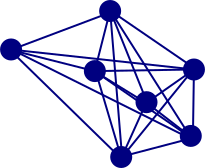
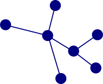
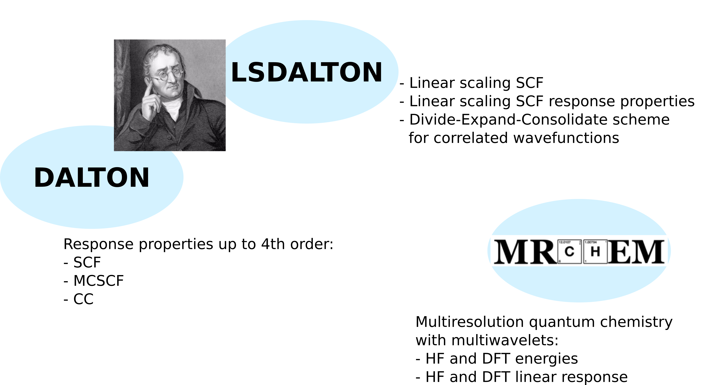
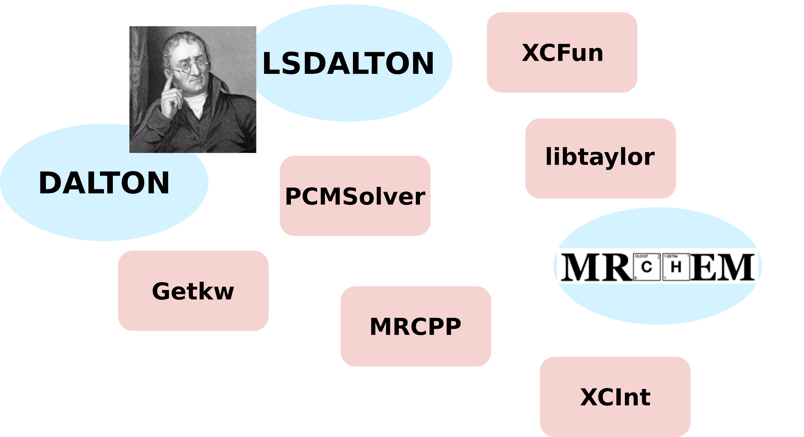
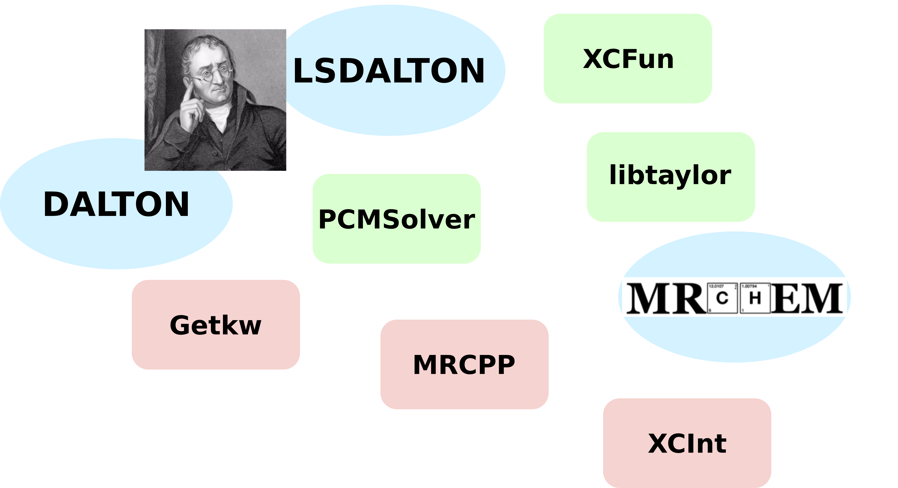
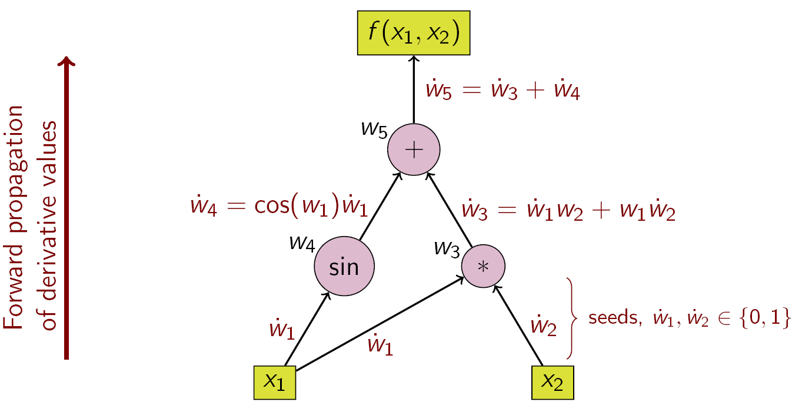
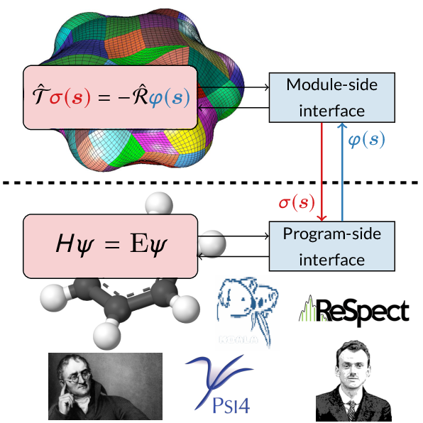
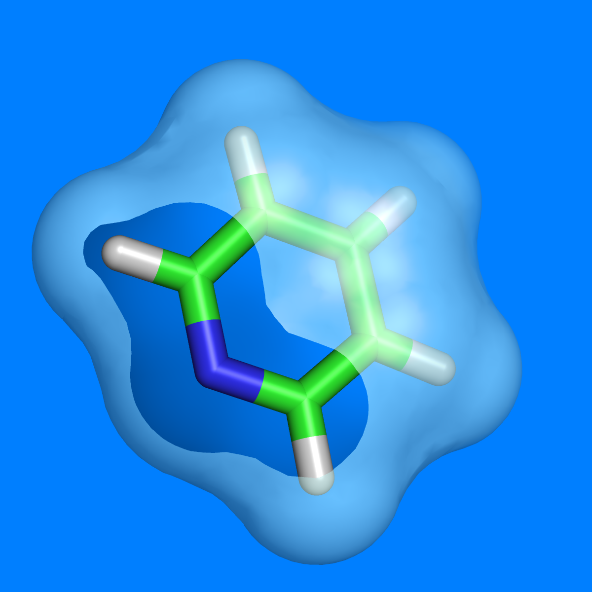
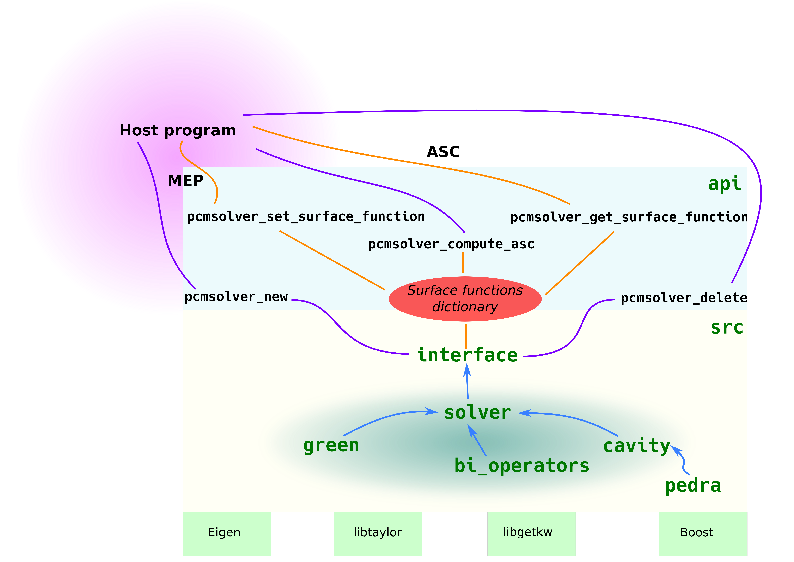
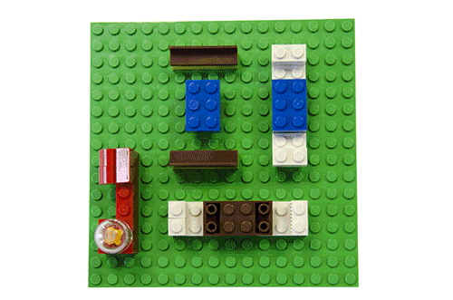

name: inverse
layout: true
class: center, middle, inverse
---
## Reusable Components for Quantum Chemistry Software

.author[Roberto Di Remigio]

.institution[UiT - The Arctic University of Norway]

.institution[Department of Chemistry - Virginia Tech]

.date[1 April 2019, Orlando]

.footnote[[CC BY 4.0](https://creativecommons.org/licenses/by/4.0/) licensed.
Browse slides at [http://tinyurl.com/talk-acs](http://tinyurl.com/talk-acs)]

???

I will present the current status of the Nordic quantum chemistry software ecosystem.
A quite diverse range of libraries and full-fledged computational codes have been developed over
many years offering unique functionality.
I will give an overview of the capabilities of the codes where I am or have been actively involved.
Particular focus will be on programming practices and lessons learnt.

---

layout: false

## Software Grows Complex Over Time

_"The complexity of software is an essential property, not an accidental one."_.red[<sup>1</sup>]

<p style="text-align:center;"></p>
<p style="clear: both;">

- We start with a simple idea and overtime software grows complex
- It is inherent characteristic of software to change and grow over time
- There is no silver bullet for managing complexity. However, there are some bad practices that we can avoid.

.footnote-cite[.red[<sup>1</sup>] Brooks, F. P., Jr. [_The Mythical Man-Month: Essays on Software Engineering_](http://worrydream.com/refs/Brooks-NoSilverBullet.pdf), Addison-Wesley Professional, 1995]

---

layout: false
class: split-50-50

## Modularity: do one thing, do it well

.column[
### Coupling
- Strong
<p style="text-align:center;"></p>
- .red[Loose]
<p style="text-align:center;"></p>
]
.column[
### Cohesion
- Low
<p style="text-align:center;"></p>
- .red[High]
<p style="text-align:center;"></p>
]
<p style="clear: both;">

.footnote-cite[Reproduced, with modifications, from [Library design the hard way](http://cicero.xyz/v2/remark/github/bast/talk-library-design/master/talk.mkd/#1) ]

???

- Coupling
    - Assemble/deassemble/reassemble
    - Reason about/understand the code

- Low cohesion: difficult to maintain, test, reuse, or even understand
    - Non-cohesive code has unnecessary dependencies
    - Swiss army knife modules

- High cohesion: associated with robustness, reliability, reusability, and understandability
    - Do one thing only and do it well
    - API of cohesive code changes less over time
    - Power of the Unix command line is a set of highly cohesive tools
    - Microservices

---

layout: false
class: split-50-50

## Application Programming Interfaces to the Rescue

From [Wikipedia](https://en.wikipedia.org/wiki/Application_programming_interface):
_In computer programming, an __application programming interface__ (__API__) is
a set of subroutine definitions, protocols, and tools for building software and
applications._

.column[
<p style="text-align:left;"></p>
<p style="clear: both;">
]
.column[
* __Encapsulation__ decide what others should know
* __Development history__ know your past
* __Documentation__ let others know what you can do
* __Versioning__ where are we at?
* __Testing__ did you mess up?
* __Building__ can it stand on its own feet?
* __Deploying__ get it out in the open!
]

???

### Encapsulation

- Hide internals by language or by convention
- Interface exposed in a separate file
- Expose the **what**, hide the **how**

### Development history

- Decouple the development history
- Each unit should have its own Git history/repository

### Documentation

- Separate the **what it can do** from **how is it implemented**
- Documented **application programming interface** (API)
- Versioned API ([semantic](http://semver.org) or [sentimental](http://sentimentalversioning.org)
  or [romantic](https://github.com/jashkenas/backbone/issues/2888#issuecomment-29076249) versioning)

### Testing

- Sharpens interfaces
- Exposes coupling and cohesion

### Building and deploying

- Prerequisite for testable on its own
- Suitable distribution mechanisms

---

## Purity

- Pure functions have no notion of state: They take input values and return
  values
- Given the same input, a pure function *always* returns the same value


- Pure functions _are_ data. They do not have side effects
- Pure functions are easy to
    - Test
    - Understand
    - Reuse
    - Parallelize
    - Simplify
    - Refactor
    - Optimize

.footnote-cite[Reproduced from [Complexity in software development by Jonas Juselius](https://github.com/scisoft/complexity)]

---

## Composition

- Build complex behavior from simple components
- We can reason about the components and the composite
- Composition is key to managing complexity
- Modularity does not imply simplicity, but is enabled by it


.footnote-cite[Slide taken from [Complexity in software development by Jonas Juselius](https://github.com/scisoft/complexity)]

---

## Overview of the Nordic infrastructure

<p style="text-align:center;"></p>
<p style="clear: both;">

???

### Programs

- DALTON
- LSDALTON
- MRChem

### Libraries

- XCFun
- XCInt
- libtaylor
- PCMSolver
- Getkw
- MRCPP

---

## Overview of the Nordic infrastructure

<p style="text-align:center;"></p>
<p style="clear: both;">

---

## Overview of the Nordic infrastructure

<p style="text-align:center;"></p>
<p style="clear: both;">

---

layout: false
class: split-50-50

## XCFun: Arbitrary Order Derivatives of XC Functionals.red[<sup>2</sup>]

.column[
<p style="text-align:left;"></p>
<p style="clear: both;">
]
.column[
XCFun uses **forward-mode AD**:

- Code on GitHub: [dftlibs/xcfun](https://github.com/dftlibs/xcfun)
- Read the docs! [xcfun.readthedocs.io](https://xcfun.readthedocs.io)
]
<p style="clear: both;">

Energy-like contributions
`$$
  \epsilon_{\mathrm{xc}}(\mathbf{r}) = \epsilon_{\mathrm{xc}}(n(\mathbf{r}), \nabla n(\mathbf{r})\cdot \nabla n(\mathbf{r}))
             = \epsilon_{\mathrm{xc}}(n(\mathbf{r}), Z(\mathbf{r}))
$$`

Fock-like contributions
`$$
  f_{\mathrm{xc};\kappa\lambda}(\mathbf{r}) = \textcolor{red}{u(\mathbf{r})}\Omega_{\kappa\lambda}(\mathbf{r}) +
      2\textcolor{blue}{\mathbf{v}(\mathbf{r})}\cdot\nabla\Omega_{\kappa\lambda}(\mathbf{r})
$$`

.footnote-cite[.red[<sup>2</sup>] Ekström, U.; Visscher, L.; Bast, R.; Thorvaldsen, A. J.; Ruud, K. _J. Chem. Theory Comput._ (2010), __6__, 1971]

???

Alternatives:
- Manual differentiation: tedious and error-prone to high orders
- Symbolic differentiation: manual verification, numerical stability?
- Automatic differentiation. Once the function is implemented, we have access to its derivatives.
  Derivatives can be expected to have the same numerical accuracy and the calculation is stable, if
  computation of the function itself is stable.

---

## XCFun: Arbitrary Order Derivatives of XC Functionals.red[<sup>*</sup>]

Prefactors $\textcolor{red}{u(\mathbf{r})}$ and $\textcolor{blue}{\mathbf{v}(\mathbf{r})}$

`$$
  \begin{align}
  \text{Unperturbed:}\quad & u = d_{1,0},\,\, \mathbf{v} = d_{0, 1}\nabla n \\
  \text{1st order:}\quad & u^{b} = d^{b}_{1,0},\,\, \mathbf{v}^{b} = d^{b}_{0, 1}\nabla n + d_{0, 1}\nabla n^{b} \\
  \text{2nd order:}\quad & u^{bc} = d^{bc}_{1,0},\,\, \mathbf{v}^{bc} = d^{bc}_{0, 1}\nabla n + d^{b}_{0, 1}\nabla n^{c} + d^{c}_{0, 1}\nabla n^{b} \\
  \text{3nd order:}\quad & u^{bcd} = d^{bcd}_{1,0},\,\, \mathbf{v}^{bcd} = d^{bcd}_{0, 1}\nabla n + d^{bc}_{0, 1}\nabla n^{d} + d^{bd}_{0, 1}\nabla n^{c} \\
   &+d^{cd}_{0, 1}\nabla n^{b} + d^{b}_{0, 1}\nabla n^{cd} + d^{c}_{0, 1}\nabla n^{bd} + d^{d}_{0, 1}\nabla n^{bc}
  \end{align}
$$`

`$$
  \begin{align}
  d_{i, j} &= \left(\frac{\partial}{\partial n}\right)^{i} \left(\frac{\partial}{\partial Z}\right)^{j} \epsilon_{\mathrm{xc}} \\
  d^{b_1 b_2\cdots b_N}_{i, j} &= \left( \frac{\mathrm{d}^{N}}{\mathrm{d}\varepsilon_{b_1}\mathrm{d}\varepsilon_{b_2} \cdots \mathrm{d}\varepsilon_{b_N}} \right) d_{i, j} \quad
  \text{e.g.}\,\, d^{b}_{i, j} = d_{i+1, j} n^b + d_{i,j+1}Z^{0,b}
  \end{align}
$$`

.footnote-cite[.red[<sup>*</sup>] Easily extended to spin-polarized DFT and GIAOs.]

---

## Using XCFun.red[<sup>*</sup>]

```cpp
// Set up functional
xc_functional fun = xc_new_functional();
xc_set(fun, "blyp", 0.9);
xc_set(fun, "pbec", 0.1);
// Input densities: na, nb, ga_x, ga_y, ga_z, gb_x, gb_y, gb_z
std::vector<double> d_elements{1, 2.1, 1.1, 1.2, 1.3, 1.4, 1.5, 1.6};
// Set up evaluation
xc_user_eval_setup(fun // Functional
                  , 1  // Derivative order
                  , 1  // Functional type: GGA
                  , 2  // Density type: alpha and beta
                  , 1  // Derivative mode: partial derivatives
                  , 0  // Laplacian? No
                  , 0  // Kinetic energy density? No
                  , 0  // Current density? No
                  , 1  // Explicit partial derivatives? Yes
                  );
// Set up output vector
int nout = xc_output_length(fun);
std::vector<double> output(nout);
xc_eval(fun, d_elements.data(), output.data());
xc_free_functional(fun);
```

.footnote-cite[.red[<sup>*</sup>] Full example available on [GitHub](https://github.com/dftlibs/xcfun).]

---

## Using XCFun

1. Get the code on GitHub and build it
```bash
git clone git@github.com:dftlibs/xcfun.git
cd xcfun
cmake -H. -Bbuild -DXCFun_XC_MAX_ORDER=6 \
                  -DCMAKE_INSTALL_PREFIX=$HOME/Software/xcfun
cmake --build build
cmake --build build --target test
cmake --build build --target install
```

2. Build the sample with CMake
```bash
cmake -H. -Bbuild_sample -DXCFun_DIR=$HOME/Software/xcfun/share/cmake/XCFun
```
3. Results
```bash
E = -3.271
E_na = -1.18765
E_nb = -1.46682
E_ga_x = -0.00617626  E_gb_x = -0.00335216
E_ga_y = -0.00674604  E_gb_y = -0.00358508
E_ga_z = -0.00731581  E_gb_z = -0.003818
```

---

layout: false
class: split-50-50

## libtaylor: Forward-Mode AD with Operator Overloading.red[<sup>*</sup>]

Automatic differentiation
- Computes a function and its derivatives at given points
- **Is not** numerical differentiation
- **Is not** automated symbolic differentiation

.column[
<p style="text-align:left;"></p>
<p style="clear: both;">
]
.column[
<p style="text-align:right;"></p>
<p style="clear: both;">
]

Advantages:
- Only need to code the function
- Derivative computation to same numerical accuracy as function

.footnote-cite[.red[<sup>*</sup>] Figures from [Wikipedia article on AD](https://en.wikipedia.org/wiki/Automatic_differentiation).]

---

layout: false
class: split-50-50

Truncated Taylor expansion: polynomial of degree $D$ in $V$ variables
`$$
\mathcal{T}_{V,D}(\mathbf{x}) = \sum_{|\alpha| = 0}^{D} \textcolor{green}{\frac{1}{\alpha!}\left. \partial^{\alpha}f \right|_{\mathbf{x}_0}}(\mathbf{x}-\mathbf{x}_0)^{\alpha}
$$`

- New _parametrized_ type, holding the Taylor coefficients

```c++
template <typename T, int V, int D> class taylor;
```
- _Overload_ operators and elementary functions

```C++
template <typename T, int Nvar, int Ndeg>
static taylor<T, Nvar, Ndeg> pow(const taylor<T, Nvar, Ndeg> & t, int n) {
  if (n > 0) {
    taylor<T, Nvar, Ndeg> res = t;
    while (n-- > 1)
      res *= t;
    return res;
  } else if (n < 0) {
    return 1 / pow(t, -n);
  } else {
    taylor<T, Nvar, Ndeg> res(1);
    return res;
  }
}
```

???

We replace all "scalars" with finite-order Taylor polynomials.

---

layout: false
class: split-50-50

## AD in action with libtaylor.red[<sup>*</sup>]

.column[
`$$
f(x, y) = \sin(\ln(7x) + \exp(y)) + 9
$$`
]
.column[
```c++
template <typename T>
T f(const T & x, const T & y) {
  return sin(log(7 * x) + exp(y)) + 9;
}
```
]

Evaluate gradient and Hessian for $x=\mathrm{e}$ and $y=\pi$
```c++
taylor<double, 2, 2> x, y;
x[0] = M_E;
x[1] = 1.0;
y[0] = M_PI;
y[2] = 1.0;
taylor<double, 2, 2> second_order = f(x, y);
second_order.deriv_facs();
std::cout << "Derivatives (grevlex)\n" << second_order << std::endl;
```

```bash
Derivatives (grevlex)
{9.8156556347, 0.212832130624, 13.3877633973, -0.188683551623, -6.94366424379, -423.389022767}
```

.footnote-cite[.red[<sup>*</sup>] Code on GitHub [https://github.com/uekstrom/libtaylor](https://github.com/uekstrom/libtaylor)]

---

## PCMSolver: An API for the Polarizable Continuum Model.red[<sup>7</sup>]

<p style="text-align:center;"></p>
<p style="clear: both;">

.footnote-cite[.red[<sup>7</sup>] Di Remigio, R.; Steindal, A. H.; Mozgawa, K.; Weijo, V.; Cao, H.; Frediani, L. [arXiv [physics.chem-ph]](https://arxiv.org/abs/1804.05895), (2018)]


???

- Coupling
    - Assemble/deassemble/reassemble
    - Reason about/understand the code

- Low cohesion: difficult to maintain, test, reuse, or even understand
    - Non-cohesive code has unnecessary dependencies
    - Swiss army knife modules

- High cohesion: associated with robustness, reliability, reusability, and understandability
    - Do one thing only and do it well
    - API of cohesive code changes less over time
    - Power of the Unix command line is a set of highly cohesive tools
    - Microservices

---
layout: false
class: split-60-40

## QM/Continuum.red[<sup>2</sup>]

- Use **quantum** and **classical** physics together
  * quantum for chemically relevant subsystem
  * _continuum dielectric_ for the environment

.column[
.red[Pros]
- **Exact** electrostatics
- Self-consistent polarization
- Statistically averaged _by construction_

.red[Cons]
- **No** chemical detail in the environment
- Dispersion and repulsion approximate
]
.column[
<p style="text-align:right;"></p>
<p style="clear: both;">
]

.footnote-cite[.red[<sup>2</sup>] Tomasi, J.; Mennucci, B.; Cammi, R. _Chem. Rev._ (2005), __105__, 2999]

???

---
layout: false
class: split-60-40

## QM/Continuum: The Polarizable Continuum Model.red[<sup>2</sup>]

.column[
### Transmission problem
`$$
  \begin{align}
  L_\mathrm{i} u &= \nabla^2 u = -4\pi\rho \,\, \text{in}\,\, \Omega_\mathrm{i} \label{eq:internal} \\
  L_\mathrm{e} u &= 0 \,\, \text{in}\,\, \Omega_\mathrm{e} \label{eq:external} \\
  [u](\mathbf{s}) &= u_\mathrm{e} - u_\mathrm{i} = 0 \,\, \text{on}\,\, \Gamma
  \label{eq:trace-jump} \\
[\partial_L u](\mathbf{s}) &= \partial_{L_\mathrm{e}} u - \partial_{L_\mathrm{i}} u = 0 \,\, \text{on}\,\, \Gamma \label{eq:conormal-jump} \\
|u(\mathbf{r})| &\leq C \|\mathbf{r} \|^{-1} \,\,\text{for}\,\,\| \mathbf{r} \|\rightarrow\infty
\label{eq:radiation}
\end{align}
$$`
]
.column[
<p style="text-align:right;"></p>
<p style="clear: both;">
]

.footnote-cite[.red[<sup>2</sup>] Tomasi, J.; Mennucci, B.; Cammi, R. _Chem. Rev._ (2005), __105__, 2999]

???

- Replace environment with continuum \\(\varepsilon\\)
- Create cavity in continuum \\(\Omega_i\\)
- Vacuum inside cavity \\(\varepsilon=1\\)
- Solute charge density _entirely_ in \\(\Omega_i\\)

- Model the solvent as a polarizable dielectric continuum
- Parameters for the definition of the boundary, i.e. the cavity
- Parameters describing the solvent: permittivity (static and optical)
- Notice that the solvent parameters are, _by definition_, averaged!
- \\(L_\star\\) are elliptic differential operators
- Trace operators are the extension of the concept of restriction of a function
  over a boundary to generalized functions in Sobolev space
- Conormal derivative extends the notion of a normal derivative to functions in
  Sobolev spaces
- \\(\sigma(\mathbf{s})\\) is called the apparent surface charge (ASC)

* \\(L_\star\\) are elliptic differential operators
* Dirichlet condition: \\([u] (\mathbf{s})\\)
* Neumann condition: \\([\partial_L u] (\mathbf{s})\\)

---
## Mathematics of PCM.red[<sup>3</sup>]

- Define the .red[reaction potential]
`$$
 u(\mathbf{r}) = \textcolor{Blue}{\varphi(\mathbf{r})} + \textcolor{Red}{\xi(\mathbf{r})}
 = \int_C \mathop{}\!\mathrm{d}\mathbf{r}^\prime \frac{\textcolor{Blue}{\rho(\mathbf{r}^\prime)}}{|\mathbf{r} - \mathbf{r}^\prime|} +
  \int_{\partial C} \mathop{}\!\mathrm{d}\mathbf{s} \frac{\textcolor{Red}{\sigma(\mathbf{s})}}{|\mathbf{r} - \mathbf{s}|}
$$`

- .red[Apparent surface charge (ASC)]
`$$
\textcolor{Green}{\mathcal{T}}\textcolor{Red}{\sigma(\mathbf{s})} = -\textcolor{Green}{\mathcal{R}}\textcolor{Blue}{\varphi(\mathbf{s})}
$$`

- Green's functions for \\(L_\star\\) define integral operators

`$$
 \begin{align}
  (\textcolor{Green}{\mathcal{S}_\star} f)(\mathbf{s}) &=
\int_{\partial C} \mathop{}\!\mathrm{d}\mathbf{s}^\prime \textcolor{Green}{G_\star(\mathbf{s}, \mathbf{s}^\prime)}f(\mathbf{s}^\prime) \\
  (\textcolor{Green}{\mathcal{D}_\star} f)(\mathbf{s}) &=
\int_{\partial C} \mathop{}\!\mathrm{d}\mathbf{s}^\prime [\partial_{L_\star}^\prime\textcolor{Green}{G_\star(\mathbf{s}, \mathbf{s}^\prime)}]f(\mathbf{s}^\prime) \\
  (\textcolor{Green}{\mathcal{D}^\dagger_\star} f)(\mathbf{s}) &=
\int_{\partial C} \mathop{}\!\mathrm{d}\mathbf{s}^\prime [\partial_{L_\star}\textcolor{Green}{G_\star(\mathbf{s}, \mathbf{s}^\prime)}]f(\mathbf{s}^\prime)
 \end{align}
$$`

.footnote-cite[.red[<sup>3</sup>] Cancès, E.; Mennucci, B. _J. Math. Chem._ (1998), __23__, 309]

???

- We've transformed a boundary value problem (BVP) into a boundary integral equation (BIE)
- Integral operators are defined in terms of traces and conormal derivatives
- The integral operators have well-defined mapping properties between Sobolev
  spaces of fractional order
- Knowledge of the Green's functions inside and outside the cavity is key to
  the method

---
layout: false
class: split-70-30

## Boundary Element Method and PCM.red[<sup>4</sup>]

.column[
Solution by a boundary element method (BEM)

* Cavity of interlocking, atom-centered spheres
* \\(N_\mathrm{ts}\\) finite elements on the cavity boundary
* Form boundary integral operators
`$$
 \textcolor{Green}{\mathbf{T}}\textcolor{Red}{\mathbf{q}} = - \textcolor{Green}{\mathbf{R}}\textcolor{Blue}{\mathbf{v}}
$$`
* Solve linear system
]
.column[
<p style="text-align:right;"></p>
<p style="clear: both;">
]

- Similar equation for IEF-PCM, isotropic PCM and COSMO
- _Independent_ of QM method!

.footnote-cite[.red[<sup>4</sup>] Ern, A; Guermond, J.-L. _Theory and Practice of Finite Elements_, Springer, 2004]

???

- _Galerkin_ or _collocation_ method
- Direct inversion or iterative solver

## PCMSolver: An API for the PCM

- Capabilities
  * Traditional collocation solvers
  * Isotropic and anisotropic Green's functions
  * Wavelet solvers (_unreleased_)
  * Real-time solvers (_in progress_)

- Build system
  * [CMake](https://cmake.org/) _via_ [Autocmake](http://autocmake.readthedocs.io/en/latest/)
  * Static and shared libraries available

- API
  * Pure C for interoperability
  * Fortran bindings built on-demand

## PCMSolver: An API for the PCM

- Testing
  * Unit tests with [Catch](https://github.com/philsquared/Catch) C++ framework
  * _Continuous integration_ (CI) on [Travis](https://travis-ci.org/)

- Release process
  * Public repo on [GitHub](https://github.com/PCMSolver/pcmsolver)
  * Precompiled library served on [Anaconda cloud](https://anaconda.org/psi4/pcmsolver)

- Documented
  * Doxygen for _in-code_ documentation
  * Sphinx for users and programmers documentation
  * Served on [ReadTheDocs](https://readthedocs.org/)

---
layout: false

## One PCM to rule them all

<p style="text-align:center;"></p>
<p style="clear: both;">

???

### Currently interfaced programs

- DALTON
- LSDALTON
- Psi4
- DIRAC
- ReSpect
- KOALA
- MADNESS

### What's in it for us?

- Separation of concerns
- Leveraging functionality


## Interfaces to QM programs

- DALTON (w/ A. H. Steindal, K. Ruud, M. Ringholm _et al._)
  * HF and DFT up to linear electric response properties
  * Interfaced also to open-ended response code (only electric)
  * Status: **unreleased**

- LSDALTON (w/ S. S. Reine)
  * HF and DFT up to linear electric response properties
  * Status: **released**

- Psi4 (w/ T. Daniel Crawford, A. Simmonett, L. A. Burns)
  * HF and DFT
  * Status: **released**

- DIRAC (w/ T. Saue)
  * 4-component, Kramers restricted, HF and DFT up to linear static electric response properties
  * Status: **released**

- ReSpect (w/ M. Repisky, S. Komorowsky, K. Ruud, S. Pipolo)
  * 4-component, Kramers restricted and unrestricted HF and DFT
  * Real-time propagation _in progress_
  * Status: **unreleased**

- KOALA (w/ S. Höfener)
  * Subsystem DFT up to linear electric response properties
  * Status: **unreleased**

---

## Using PCMSolver

- Loosely coupled
- Highly cohesive

```Fortran
! Initialize PCMSolver
! --------------------
! 1. Generate cavity and BEM solver
pcm_context = pcmsolver_new(...)
! 2. Get cavity points, needed to compute MEP
call pcmsolver_get_centers(pcm_context, ...)

! SCF Cycle
! ---------
! 1. Set surface function with MEP@cavity
call pcmsolver_set_surface_function(pcm_context, ...)
! 2. Compute ASC given the MEP
call pcmsolver_compute_asc(pcm_context, ...)
! 3. Get values of ASC@cavity from surface function
call pcmsolver_get_surface_function(pcm_context, ...)
! 4. Compute polarization energy from MEP/ASC pair
energy = pcmsolver_compute_polarization_energy(pcm_context, ...)
! Clean up API context
call pcmsolver_delete(pcm_context)
```
---

<p style="text-align:left;"></p>
<p style="clear: both;">

???

[Context-aware](https://github.com/bast/context-api-example) API
  * Confine state to module
  * Multiple contexts possible
  * Operations require context
  * Enforce namespacing by convention
  * `get` and `set` functions

[Surface functions](http://pcmsolver.readthedocs.io/en/latest/users/interfacing.html#how-pcmsolver-handles-potentials-and-charges-surface-functions)
  * PCM \\(\Leftrightarrow\\) functions defined on cavity surface
  * Function label + function data = surface function
  * Map of labels and data

```Fortran
use, intrinsic :: iso_c_binding
use pcmsolver
type(c_ptr) :: pcm_context
character(kind=c_char, len=1) :: mep_lbl(7) =  &
                                 (/'N', 'u', 'c', 'M', 'E', 'P', c_null_char/)
character(kind=c_char, len=1) :: asc_lbl(7) =  &
                                 (/'N', 'u', 'c', 'A', 'S', 'C', c_null_char/)
real(c_double), allocatable :: grid(:), mep(:), asc(:)
integer(c_int) :: irrep
integer(c_int) :: grid_size, irr_grid_size
real(c_double) :: energy

pcm_context = pcmsolver_new(PCMSOLVER_READER_OWN,           &
                            nr_nuclei, charges, coordinates, &
                            symmetry_info, host_input)

call pcmsolver_print(pcm_context)
grid_size = pcmsolver_get_cavity_size(pcm_context)
irr_grid_size = pcmsolver_get_irreducible_cavity_size(pcm_context)
allocate(grid(3*grid_size))
grid = 0.0d0
call pcmsolver_get_centers(pcm_context, grid)

allocate(mep(grid_size))
mep = 0.0d0
mep = nuclear_mep(nr_nuclei, charges, &
                  reshape(coordinates, (/ 3, nr_nuclei /)), &
                  grid_size, reshape(grid, (/ 3, grid_size /)))
call pcmsolver_set_surface_function(pcm_context, grid_size, mep, mep_lbl)
irrep = 0
call pcmsolver_compute_asc(pcm_context, mep_lbl, asc_lbl, irrep)
allocate(asc(grid_size))
asc = 0.0d0
call pcmsolver_get_surface_function(pcm_context, grid_size, asc, asc_lbl)
energy = pcmsolver_compute_polarization_energy(pcm_context, mep_lbl, asc_lbl)
```

---
layout: false

## Extensible
### New Challenges! New Methods! New Software?!?

<p style="text-align:center;"></p>
<p style="clear: both;">

???

- New modelling challenges require new (or improved) methods and new (or
  improved) software implementations.
- Software cannot be rewritten from scratch every time, we need to have
  _extensible_ architectures

---
layout: false

## Modular
### Do One Thing, Do It Well
<p style="text-align:center;"></p>
<p style="clear: both;">

???

- Fast-paced development cycles can only occur within a clear software structure
- Delimit capabilities, concerns, results
- Modularity can help create such a structure
- A LEGO-like structure can enhance our capabilities to reason about complex software workflows.
- Assemble, de-assemble, re-assemble is easier with standalone modules.

---
layout: false

## Sustainable
### Software Reuse for a Better Life

<p style="text-align:center;"></p>
<p style="clear: both;">

.footnote-cite[Source: [IBM Big Data & Analytics Hub](http://www.ibmbigdatahub.com/blog/dont-reinvent-wheel-increase-productivity-strategic-reuse)]

???

- Reinventing the wheel is bad
- Build small, well-documented software components
- Reuse components in different contexts

---
layout: false

## Viral!
### Software Development Is Essential to Quantum Chemistry
<p style="text-align:center;"></p>
<p style="clear: both;">

???

- Software development in essential to quantum chemistry.
- Software architecture must allow fast development of new methods. We want to
  solve physical problems, not software engineering problems.
- The central tenet of the scientific method is reproducibility. Our work is
  based on models and their computer simulation, these must be reproducible
  too.red[<sup>1</sup>]

.footnote-cite[.red[<sup>1</sup>] Hatton, L.; Warr, G. [arXiv [q-bio.QM]](https://arxiv.org/abs/1608.06897), (2016)]


---
layout: false

## Acknowledgements

__Radovan Bast__ .cite[University of Tromsø]

__Stig Rune Jensen__ .cite[Hylleraas Centre, University of Tromsø]

<p style="text-align:center;"></p>
<p style="clear: both;">

---
layout: false

## Commercial

All examples online [https://github.com/dev-cafe/cmake-cookbook](https://github.com/dev-cafe/cmake-cookbook)

<p style="text-align:center;"></p>
<p style="clear: both;">

---
name: last-page
template: inverse

# Thanks for your attention!

<p style="text-align:center;"></p>
<p style="clear: both;">

Slideshow created using [remark] and served using [cicero]

Slides available on [GitHub](https://github.com/robertodr/talk-acs)

Browse slides at [http://tinyurl.com/talk-acs](http://tinyurl.com/talk-acs)

[remark]: https://github.com/gnab/remark
[cicero]: https://github.com/bast/cicero
